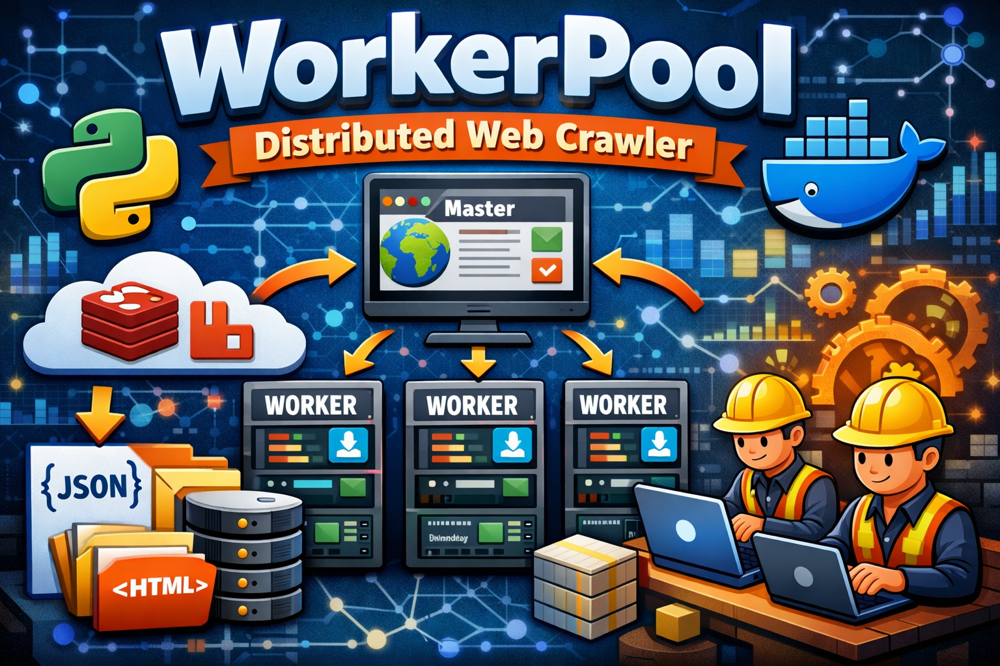
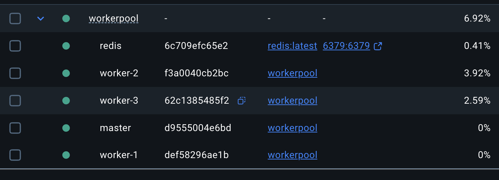
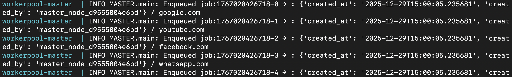
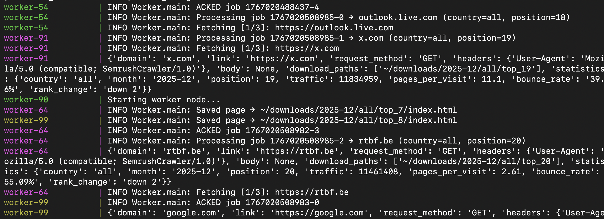

# **Distributed Worker Pool**
*Core focus:  Distributed Systems, Concurrency, Web Crawling*
*Technologies:  Redis, Python, Docker*




A distributed web crawling platform using a master-worker architecture. The master enqueues the top sites per country, and workers download pages in parallel using a shared message queue.

-   Master gathers URLs and prepares enqueue-ready tasks.
-   Workers download and persist pages to desired locations.   
-   The system handles parallel load through Docker Compose, retries failures, and avoids message loss.
-   Workers communicate through Redis streams message queue.
-   Master and workers produce structured logs and summaries of processed tasks.


# Modules
### Parallelism, Scaling & Failure Recovery
-   Support multiple worker instances
-   Retry failed downloads
-   Detect malformed messages or network issues

**Functional Output:**  System handles parallel load, retries failures, and avoids message loss.
```bash
# Build the containers. X is the number of worker instances.
docker compose up --build --scale worker=X
```


### Queue Setup, CLI Parsing & System Layout

Define architecture and communication through Redis/RabbitMQ.

-   Validate queue configuration
-   Define JSON message format (link, disk path)
-   Prepare folder structure and logging

**Functional Output:**  System correctly connects to the queue and accepts enqueue/dequeue operations.


### Master Crawler for Semrush Country Pages

-   Fetch Semrush country listing pages (HTML parsing only)
-   Extract top 20 links per country
-   Generate storage paths

**Functional Output:**  Master gathers URLs and prepares enqueue-ready tasks.



### Worker Implementation for Page Downloads

-   Consume tasks from queue
-   Download HTML content with error handling
-   Save page to specified disk location

**Functional Output:**  Workers download and persist pages to the correct folders.


**Description**: This image demonstrates the system's capability to handle multiple concurrent requests efficiently, running 100 instances of workers

### Logging, Monitoring & System Polishing

-   Master and workers produce structured logs
-   Summaries of processed tasks
-   Optional monitoring dashboard or counters

  
## Contributing
Developed by Iancu Stefan-Teodor for academic purposes. Submit pull requests or open issues for suggestions.

## License
MIT License. For academic use only, not licensed for commercial purposes.

## Connect with Me
[LinkedIn](https://www.linkedin.com/in/stefan-teodor-iancu-152a6a284/)


